```python
import pandas as pd
import matplotlib.pyplot as plt
%matplotlib inline
```


```python
train = pd.read_csv('./dataset/train.csv')
```


```python
train.shape #891 data rows and 12 collumns
```


    (891, 12)


```python
train.info()
```

    <class 'pandas.core.frame.DataFrame'>
    RangeIndex: 891 entries, 0 to 890
    Data columns (total 12 columns):
    PassengerId    891 non-null int64
    Survived       891 non-null int64
    Pclass         891 non-null int64
    Name           891 non-null object
    Sex            891 non-null object
    Age            714 non-null float64
    SibSp          891 non-null int64
    Parch          891 non-null int64
    Ticket         891 non-null object
    Fare           891 non-null float64
    Cabin          204 non-null object
    Embarked       889 non-null object
    dtypes: float64(2), int64(5), object(5)
    memory usage: 83.6+ KB


```python
train.head(7)
```


<div>
<style scoped>
    .dataframe tbody tr th:only-of-type {
        vertical-align: middle;
    }

    .dataframe tbody tr th {
        vertical-align: top;
    }

    .dataframe thead th {
        text-align: right;
    }
</style>
<table border="1" class="dataframe">
  <thead>
    <tr style="text-align: right;">
      <th></th>
      <th>PassengerId</th>
      <th>Survived</th>
      <th>Pclass</th>
      <th>Name</th>
      <th>Sex</th>
      <th>Age</th>
      <th>SibSp</th>
      <th>Parch</th>
      <th>Ticket</th>
      <th>Fare</th>
      <th>Cabin</th>
      <th>Embarked</th>
    </tr>
  </thead>
  <tbody>
    <tr>
      <th>0</th>
      <td>1</td>
      <td>0</td>
      <td>3</td>
      <td>Braund, Mr. Owen Harris</td>
      <td>male</td>
      <td>22.0</td>
      <td>1</td>
      <td>0</td>
      <td>A/5 21171</td>
      <td>7.2500</td>
      <td>NaN</td>
      <td>S</td>
    </tr>
    <tr>
      <th>1</th>
      <td>2</td>
      <td>1</td>
      <td>1</td>
      <td>Cumings, Mrs. John Bradley (Florence Briggs Th...</td>
      <td>female</td>
      <td>38.0</td>
      <td>1</td>
      <td>0</td>
      <td>PC 17599</td>
      <td>71.2833</td>
      <td>C85</td>
      <td>C</td>
    </tr>
    <tr>
      <th>2</th>
      <td>3</td>
      <td>1</td>
      <td>3</td>
      <td>Heikkinen, Miss. Laina</td>
      <td>female</td>
      <td>26.0</td>
      <td>0</td>
      <td>0</td>
      <td>STON/O2. 3101282</td>
      <td>7.9250</td>
      <td>NaN</td>
      <td>S</td>
    </tr>
    <tr>
      <th>3</th>
      <td>4</td>
      <td>1</td>
      <td>1</td>
      <td>Futrelle, Mrs. Jacques Heath (Lily May Peel)</td>
      <td>female</td>
      <td>35.0</td>
      <td>1</td>
      <td>0</td>
      <td>113803</td>
      <td>53.1000</td>
      <td>C123</td>
      <td>S</td>
    </tr>
    <tr>
      <th>4</th>
      <td>5</td>
      <td>0</td>
      <td>3</td>
      <td>Allen, Mr. William Henry</td>
      <td>male</td>
      <td>35.0</td>
      <td>0</td>
      <td>0</td>
      <td>373450</td>
      <td>8.0500</td>
      <td>NaN</td>
      <td>S</td>
    </tr>
    <tr>
      <th>5</th>
      <td>6</td>
      <td>0</td>
      <td>3</td>
      <td>Moran, Mr. James</td>
      <td>male</td>
      <td>NaN</td>
      <td>0</td>
      <td>0</td>
      <td>330877</td>
      <td>8.4583</td>
      <td>NaN</td>
      <td>Q</td>
    </tr>
    <tr>
      <th>6</th>
      <td>7</td>
      <td>0</td>
      <td>1</td>
      <td>McCarthy, Mr. Timothy J</td>
      <td>male</td>
      <td>54.0</td>
      <td>0</td>
      <td>0</td>
      <td>17463</td>
      <td>51.8625</td>
      <td>E46</td>
      <td>S</td>
    </tr>
  </tbody>
</table>
</div>


```python
value_count=train["Survived"].value_counts(normalize=True)
value_count
```


    0    0.616162
    1    0.383838
    Name: Survived, dtype: float64


```python
value_count.plot(kind='bar',title='Survival rate: 0=dead, 1=survive')
plt.show()
```


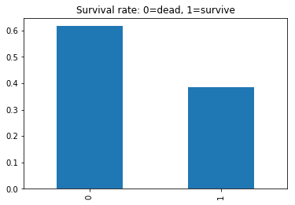


# Survival by ages, scatter chart #
#### Based on the below chart it would appear most fortunate were the children and younger people. ###


```python
plt.scatter(train['Survived'],train["Age"], alpha=0.2)
plt.show()
```


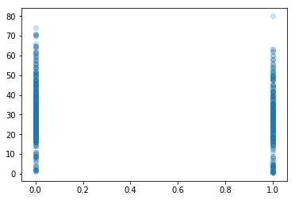


# Percentage of people by class #


```python
pclass = train['Pclass'].value_counts(normalize=True)
pclass
```


    3    0.551066
    1    0.242424
    2    0.206510
    Name: Pclass, dtype: float64


```python
pclass.plot(kind='bar',title='passenger classes')
plt.show()
```


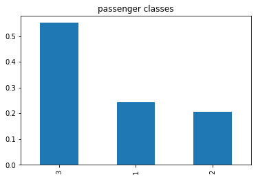


# Distribution of ages and classes of people #
### Based on the chart, the people from the first class were the oldest ones while the 3rd class passengers were the youngest ones. Ergo, wealth is obtained at a later age. ###


```python
for x in [1,2,3]: 
    train['Age'][train['Pclass'] == x].plot(kind='kde', figsize=(10,5))
plt.title('Class with regards to Age')
plt.legend(['1st','2nd','3rd'])
plt.show()
```


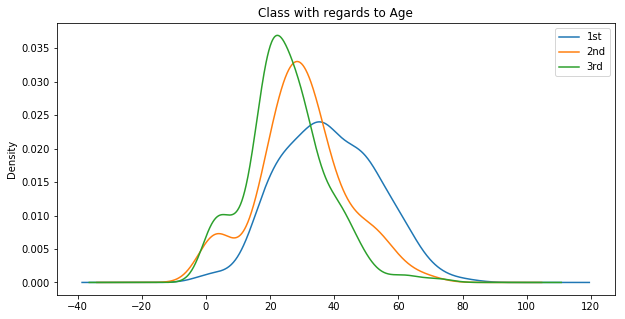


# Percentage of people who survived or not #


```python
survived = train['Survived'] 
survived

```


    0    0.616162
    1    0.383838
    Name: Survived, dtype: float64


# A KDE graph on survival depending on class #
### Please note the 0 and 1 curbs represent death vs survival rates. ###
#### Also at first glance, most unfortunate were the 3rd class people while the 1st class had the highest survival rate. ####


```python
for x in [1,2,3]: 
    train['Survived'][train['Pclass'] == x].plot(kind='kde', figsize=(11,5))
plt.title('Survived with regards to Class')
plt.legend(['1st','2nd','3rd'])
plt.show()

```


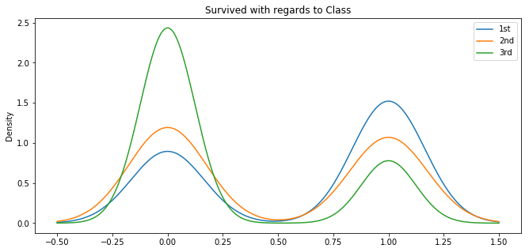


# Surviving people with regards to class, as bar graph representation. #
### Obs.: compared to the KDE graph , the bar chart focuses only on the people who survived, therefore the impression is that there was little difference between 1st and 3rd class survival counts. In reality, given that 3rd class passengers were a much bigger group, their survival rate is much lower than presented here.###


```python
survivedPcls=train['Pclass'][train['Survived'] == 1].value_counts(normalize=True)
survivedPcls.plot(kind='bar')
plt.title('Survived with regards to class')
plt.show()
```


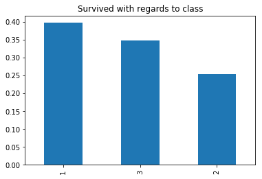


# Percentages of embarked people by location #
### Note: over 70% embarked in the first point of Southampton ###


```python
total_embarked = train['Embarked'].value_counts(normalize=True)
total_embarked.plot(kind='bar')
plt.show()
```


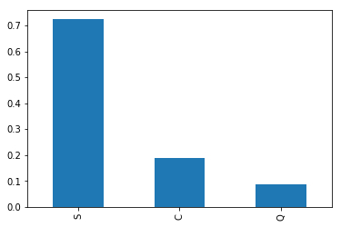


# Bar graph to show no. of people who survived according to embarked locations #
### Note: The biggest survival rate comes from Southampton, which is to be expected considering that the majority of people took the cruise from that point. ###


```python
sur_emb = train['Embarked'][train["Survived"] == 1].value_counts()
sur_emb.plot(kind='bar')
plt.show()
```


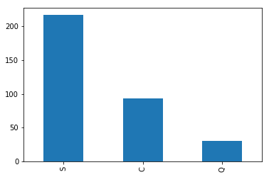


# Bar representation on percentages of men that survived #


```python
men = train['Survived'][train['Sex'] =='male'].value_counts(normalize=True)
men.plot(kind='bar')
plt.show()
```


# Bar representation on percentages of women that survived #


```python
women = train['Survived'][train['Sex'] =='female'].value_counts(normalize=True)
women.plot(kind='bar', color='red')
plt.show()
```


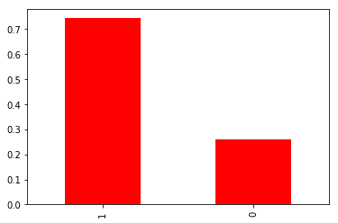


# Total survival rates by gender #
### Note: it appears so far that women were given priority in the rescuing process. ###


```python
total_sur_gender=train['Sex'][train['Survived']==1].value_counts(normalize=True)
total_sur_gender.plot(kind='bar',color=['red','b'])
plt.show()
```


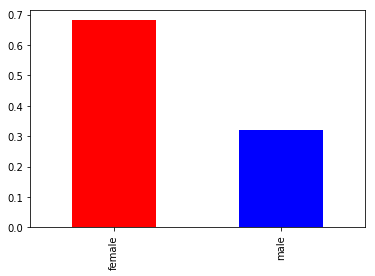


# Now a round a comparison of survivals by ticket/social class status and genders #
### Small conclusion: if general consensus is that women live longer than men, in this case obviously rich women have double chances of living longer than their less fortunate peers. ###
#### Please keep in mind, that the value 0 represents the ones who died in the Titanic incident, while 1 stands for the survivors. ####


```python
rich_men = train['Survived'][(train['Pclass']==1) & (train["Sex"]=='male')].value_counts(normalize=True)
rich_men.plot(kind='bar')
plt.show()
```


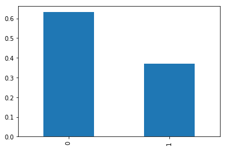


```python
poor_men = train['Survived'][(train['Pclass']==3) & (train["Sex"]=='male')].value_counts(normalize=True)
poor_men.plot(kind='bar')
plt.show()
```


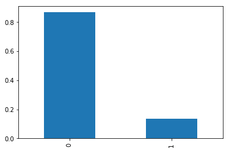


```python
rich_women = train['Survived'][(train['Pclass']==1) & (train["Sex"]=='female')].value_counts(normalize=True)
rich_women.plot(kind='bar', color='red')
plt.show()
```


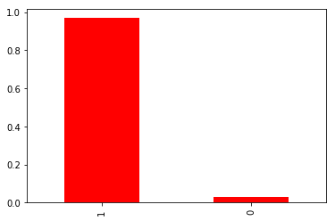


```python
poor_women = train['Survived'][(train['Pclass']==3) & (train["Sex"]=='female')].value_counts(normalize=True)
poor_women.plot(kind='bar',color='red')
plt.show()
```


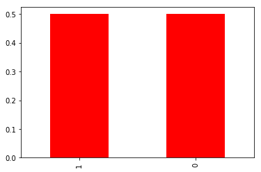


# And finally some stacked representations of survival vs death rates overall. #


```python
def plot_bar_chart(feature):
    dead = train[train['Survived']==0][feature].value_counts()
    survived = train[train['Survived']==1][feature].value_counts()
    df = pd.DataFrame([survived, dead])
    df.index=["Survived","Dead"]
    df.plot(kind='bar', stacked=True, figsize=(10,5), color=['red','b','green'])
```


```python
plot_bar_chart('Sex')
```


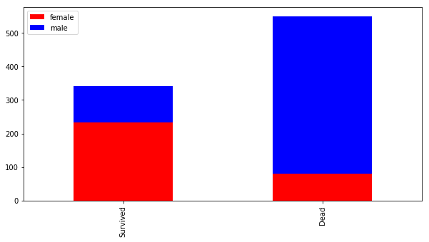


## The last chart shows the distribution between classes. It would appear that the 1st class travellers were the most fortunate ones while the 3rd class whitnessed the highest death rates. ##


```python
plot_bar_chart('Pclass')
```


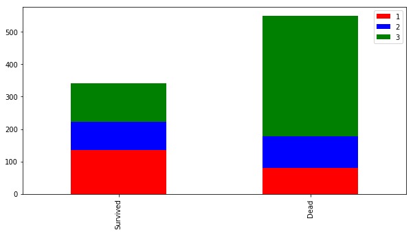


```python

```
